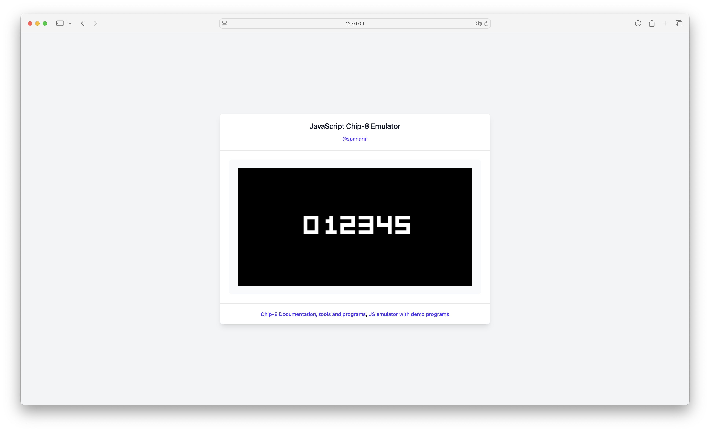
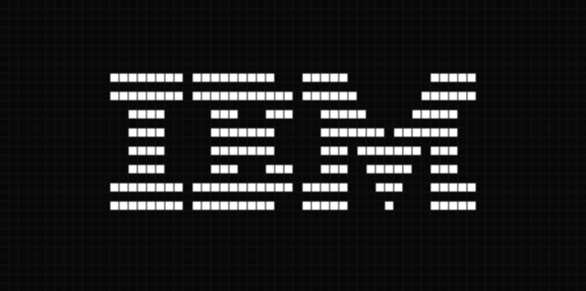
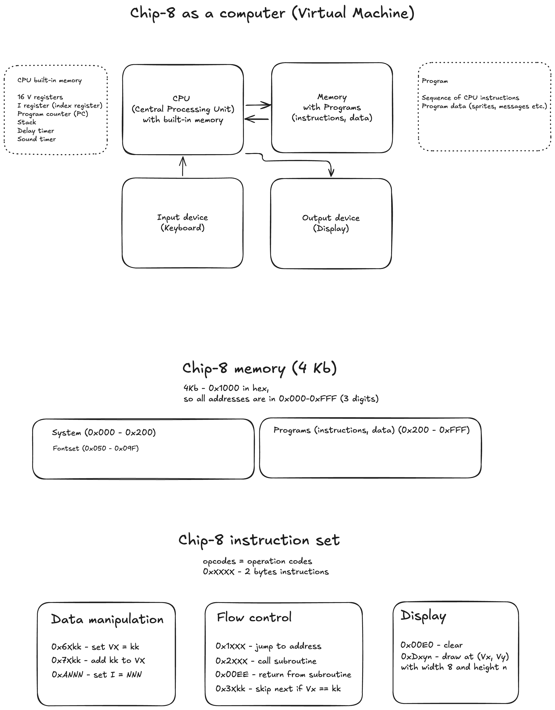

# JavaScript Chip-8 Emulator

## YouTube tutorial: [JavaScript Tutorial: Building a Chip-8 Emulator](https://www.youtube.com/playlist?list=PL--xKBEKHeJSo3sP80J_TJtmQ2T_AJRbl)

## Usage

1. Clone/Download repo
2. Unzip repo
3. Open file `index.html` in any browser (Chrome, Safari, FireFox)

## Demo

## Tests

Full tests suite: [Chip-8 test suite](https://github.com/Timendus/chip8-test-suite/)

### IBM Logo test
Test description: simple test to draw IBM logo [from Tobias' guide](https://tobiasvl.github.io/blog/write-a-chip-8-emulator/#instructions)

Test code: [IBM Logo.ch8](https://github.com/loktar00/chip8/blob/master/roms/IBM%20Logo.ch8)

## Tech stack used

- HTML
- vanilla JavaScript
- Tailwind CSS with TailwindUI components

## Chip-8 architecture, memory map and instruction set

Full opcodes list: [Gulrak's table of opcodes](https://chip8.gulrak.net)

